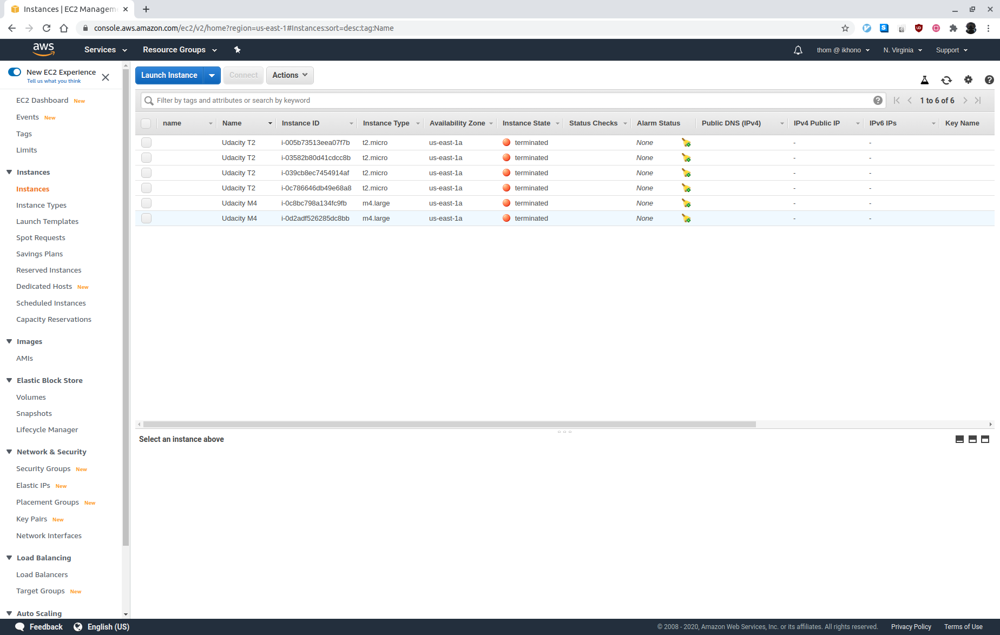

# Udacity AWS Cloud Architect Program - Project 2: Design, Provision and Monitor AWS Infrastructure at Scale

This project plans, designs, provisions, and monitors infrastructure in AWS using industry-standard and open source tools. It showcases how to optimize infrastructure for cost and performance, and uses Terraform to provision and configure AWS services in a global configuration.

## Task 1: Create AWS Architecture Schematics

### Part 1

Plan and provision a cost-effective AWS infrastructure for a new social media application development project for 50,000 single-region users. The project requires the following AWS infrastructure and services:

- Infrastructure in the following regions: us-east-1
- Users and Client machines
- One VPC
- Two Availability Zones
- Four Subnets (2 Public, 2 Private)
- A NAT Gateway
- A CloudFront distribution with an S3 bucket
- Web servers in the Public Subnets sized according to the usage estimates
- Application Servers in the Private Subnets sized according to the usage estimates
- DB Servers in the Private Subnets
- Web Servers Load Balanced and Autoscaled
- Application Servers Load Balanced and Autoscaled
- A Master DB in AZ1 with a read replica in AZ2
- AWS Route 53

 _AWS Social Media Application_

### Part 2

Plan a serverless architecture schematic for a new application development project using the following AWS infrastructure and services:

- A user and client machine
- AWS Route 53
- A CloudFront Distribution
- AWS Cognito
- AWS Lambda
- API Gateway
- DynamoDB
- S3 Storage

 _AWS Serverless Application_

## Task 2: Calculate Infrastructure Costs

### Initial cost estimate

Assumptions:

- 50,000 users
- Web server:
  - 6 x a1.large with Linux and NGINX (see [NGINX whitepaper](https://www.arm.com/-/media/global/solutions/infrastructure/NGINX_A1%20whitepaper.pdf))
  - Amazon Route 53
- Application server:
  - 6 x m5.large
- Structured data is stored in RDS (MySQL):
  - A Master DB in AZ1 with a read replica in AZ2 (db.m5.xlarge)
  - Assumption is that every user creates 1MB of structured data per month:
    - 50GB of structured data added to RDS per month
- Files, pictures and videos are stored in S3, with quotas enforced to prevent overrun:
  - Each user generates 2GB of storage per year: 100TB S3 Intelligent-Tiering
  - In addition to the 2GB for the current year, users can store 20GB (10 years worth of storage): 1000TB S3 Glacier
  - On average every user will create 150MB and consume 1GB data per month:
    - 7.5TB inbound and 50TB outbound traffic
  - On average every user will make 150 PUT and 2000 GET requests per month:
    - 7,500,000 PUT requests and 100,000,000 GET requests overall per month
- NAT gateway:
  - Assumption is that 10GB per month for OS and application updates are needed
- Two application load balancer (public and private):
  - Maximum 50,000 active connections per minute
  - Assume that the average HTTP request/response is 2KB and each user performs 1,500 requests per day
  - This leads to about 90MB of HTTP requests/responses per user per month, 4500GB in total

Total monthly cost: $9,619.37 (see [Initial_Cost_Estimate.csv](cost-estimates/Initial_Cost_Estimate.csv)).

### Reduced cost estimate

If the budget was reduced from $8,000-$10,000 to a maximum of $6,500, I would change the data transfer and storage quotas:
- Change quota of data generated per user per year to 1GB per year and 10GB overall
- Users are only allowed to consume 500MB per month (25TB outbound traffic)

Total monthly cost: $6,481.37 (see [Reduced_Cost_Estimate.csv](cost-estimates/Reduced_Cost_Estimate.csv)).

#### Rationale for changes

The main cost drivers are the S3 storage and the data transfer (CloudFront):
- Cutting the quota of data generated per user in half (from 2GB per year and 20GB overall to 1 GB per year and 10GB overall), reduces the cost for S3 storage from $2,590 to $1,630
- Restricting the outbound traffic from 1GB to 500MB per user reduces data transfer cost from $4,400 to $2,230

Other possible cost saving options which I have not implemented but should be reviewed:
- Replace the EC2 On Demand with Reserved Instances
- Reduce the number of EC2 instances for web and application server

### Increased cost estimate

If the budget has been increased to $20,000, I would add additional compute and redundancy:
- Upgrade the web server instance types to a1.4xlarge and add 2 additional instances
- Upgrade the application server instance types to m5.4xlarge and add 2 additional instances
- Upgrade the RDS instance types to db.m5.4xlarge, change it to Multi-AZ and add an additional read replica

Total monthly cost: $18,043.36 (see [Increased_Cost Estimate.csv](cost-estimates/Increased_Cost_Estimate.csv)).

#### Rationale for changes

With the additional budget, the server availability and capacity should be increased:
- Upgrading the web server instance types to a1.4xlarge and adding 2 additional instances increases the capacity and the availability
- Upgrading the application server instance types to m5.4xlarge and adding 2 additional instances increases the capacity and the availability
- Upgrading the RDS instance types to db.m5.4xlarge, changing it to Multi-AZ and adding  an additional read replica increases the capacity and the availability

## Task 3: Configure Permissions

### Updated password policy

 _Updated password policy_

### Cloud Trail

See [UdacityCloudTrailLog.csv](logs/UdacityCloudTrailLog.csv).

## Task 4: Set up Cost Monitoring

 _CloudWatch billing alarm_

## Task 5 : Use Terraform to Provision AWS Infrastructure

### Part 1

Terraform code to provision (see [main.tf](tf-infrastructure/main.tf)):
- AWS as the cloud provider
- Use an existing VPC ID
- Use an existing public subnet
- 4 AWS t2.micro EC2 instances named Udacity T2
- 2 m4.large EC2 instances named Udacity M4

 _All instances_

 _After deleting 2 instances_

### Part 2

Code to deploy an AWS Lambda Function using Terraform:
- [greet_lambda.py](tf-infrastructure/greet_lambda.py)
- [main.tf](tf-infrastructure/main.tf)
- [outputs.tf](tf-infrastructure/outputs.tf)
- [variables.tf](tf-infrastructure/variables.tf)

 _EC2 instances_

 _VPC_

 _CloudWatch log entry_

## Task 6: Destroy the Infrastructure using Terraform and prepare for submission

 _Destroyed infrastructure_

## Requirements

Graded according to the [Project Rubric](https://review.udacity.com/#!/rubrics/2757/view).

## License

- **[MIT license](http://opensource.org/licenses/mit-license.php)**
- Copyright 2020 © [Thomas Weibel](https://github.com/thom).